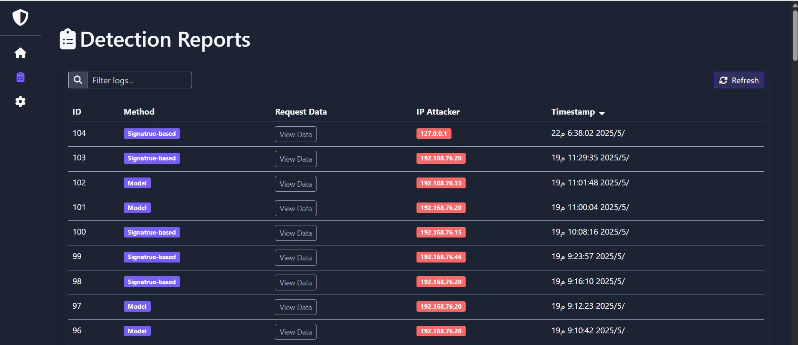

# 🛡️ SQLi-IDPS: Intelligent SQL Injection Detection & Prevention System

<!-- Badges Section -->
[](https://opensource.org/licenses/MIT)
[](https://www.python.org/downloads/release/python-3110/)
[](https://flask.palletsprojects.com/)
[](https://www.nginx.com/)
[]()
[]()

---


Welcome to the repository of my graduation project: **SQLi-IDPS**, an intelligent system designed to detect and prevent **SQL Injection (SQLi)** attacks. I developed this system to provide a robust, real-time defense layer for web applications using a **Reverse Proxy** architecture.

The core objective of this project was to build a security solution that sits in front of any web application, inspecting incoming traffic and blocking malicious payloads before they ever reach the backend server.

---

## 🧠 How It Works (Hybrid Detection Methodology)

I implemented a **Hybrid Detection Strategy** that combines speed with high accuracy:

1.  **Nginx Reverse Proxy:** All incoming HTTP/HTTPS requests are intercepted by Nginx. Using a custom **Lua** module, the request data is forwarded to my inspection service.
2.  **Dual-Layer Inspection:**
    *   **Signature-based Detection:** Utilizing the `libinjection` library for lightning-fast detection of known SQLi patterns.
    *   **Machine Learning-based Detection:** Leveraging a trained **Support Vector Machine (SVM)** model to identify complex, obfuscated, or zero-day attacks that traditional signatures might miss.
3.  **Real-time Response:** If an attack is detected, the request is blocked immediately with a `403 Forbidden` response. The incident is logged, and an instant alert is sent to the administrator via Email/SMS.

### System Architecture

The following diagram illustrates the data flow and how the components interact:


---

## 💻 Technologies & Tools

I chose a powerful stack to ensure reliability and performance:

| Component | Technology | My Role |
| :--- | :--- | :--- |
| **Backend Service** | **Python + Flask** | Developed the inspection engine, RESTful APIs, and management logic. |
| **Web Server/Proxy** | **Nginx + Lua** | Configured the reverse proxy and integrated it with the Python backend. |
| **AI/Machine Learning** | **Scikit-learn (SVM)** | Trained and optimized the ML model for high-precision detection. |
| **Frontend Dashboard** | **React.js (Integrated)** | Designed a modern UI for monitoring logs, alerts, and system status. |
| **Database** | **SQLite / SQLAlchemy** | Managed local storage for incident logs and system configurations. |

---

## 📸 System Screenshots

Here is a look at the final product in action:

| Feature | Screenshot |
| :--- | :--- |
| **Login Interface** |  |
| **Main Dashboard** |  |
| **Detection Reports** |  |
| **Workflow Diagram** |  |

---

## 🚀 Quick Start Guide

To run this project locally:

1.  **Install Dependencies:**
    ```bash
    pip install -r requirements.txt
    ```
2.  **Run the Application:**
    ```bash
    python main.py
    ```
3.  **Access the Dashboard:** Open `http://localhost:5000` in your browser.
    *   **Default Credentials:** `admin` / `password`

---

## 👨‍🎓 Project Information

This project was completed as part of the requirements for a Bachelor's degree in **Cybersecurity**.

*   **Academic Institution:** University of Science and Technology.
*   **e-mail:** [alaqlqlan47@gmail.com ]
*   **Developed by:** [khaled abdulsattar]

---

## ⚖️ License
This project is licensed under the **MIT License**. See the [MIT License.md] file for details.
